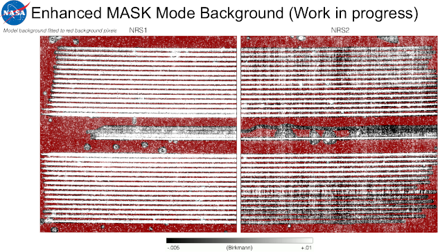

# Using and Making NSClean Background Masks

This document explains how to use and make background pixel masks. A mask is just $2048\times 2048$ boolean image. The background model is fitted to pixels set =True. Pixels set =False are ignored.

## 1. Using Masks

Although it is possible to use NSClean without specifying which pixels to use for modeling the background, it works better if you do. This is the "enhanced mask mode". Enhanced mask mode uses as many background samples as possible to build a high fidelity background model.

Figure 1 shows that masks that I used for initial development. These are for IFU observations. The background model is fitted to the red shaded pixels. Importantly, the masks identify background pixels even between the spectral traces. In case they might be useful, these masks are saved in NSClean's `lib/` folder. They are the two "thorough" masks.

## 2. Making Masks

In general, it will be necessary to make a custom mask (or masks) for your observations. According to Stephan Birkmann of the NIRSpec team, it should eventually be possible to automatically make masks using the instrument model and known information about the observations. Until then, I have been making them by hand.

Here is the procedure. This assumes that you are familiar with the GNU image manipulation program (GIMP). If you do not know GIMP, any image manipulation program should work. The important points are: (1) the underlying image must be grayscale and (2) background pixels must be set to pure red, RGB = xFF0000.

1. Using the pipeline, calibrate the data through to Stage 1 rate images. These are also known as "slope images".
2. For this program, the spectral traces all appeared to fall on the same areas of the detector. So, I averaged them all together to increase the signal-to-noise.
3. Using SAOImage DS9, I displayed the mean rate images and chose a revealing grayscale. Then, I saved them using File > Export > PNG... This yielded two $2048\times2048$ pixel PNG images.
4. I used the GNU Image Manipulation Program (GIMP) open the PNGs.
5. Add a layer named "light"
6. Color all visible light in the images something obvious. I used pure blue, x0000FF.
7. Add a layer named "dark"
8. Select all the pure blue pixels and invert the selection to get just the background pixels.
9. Color them pure red, xFF0000, and save as a PNG.
10. NSClean's png2fits function (in util.py) to convert the PNG file to FITS.
11. With a little practice, it is possible to make masks like those shown in Figure 1.

